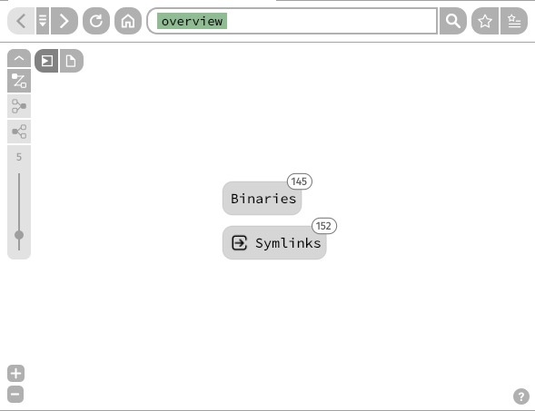
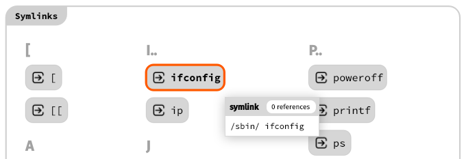
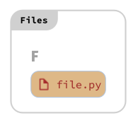
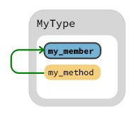
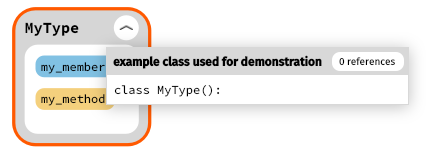
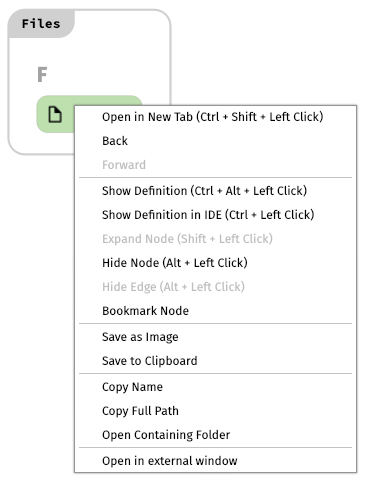
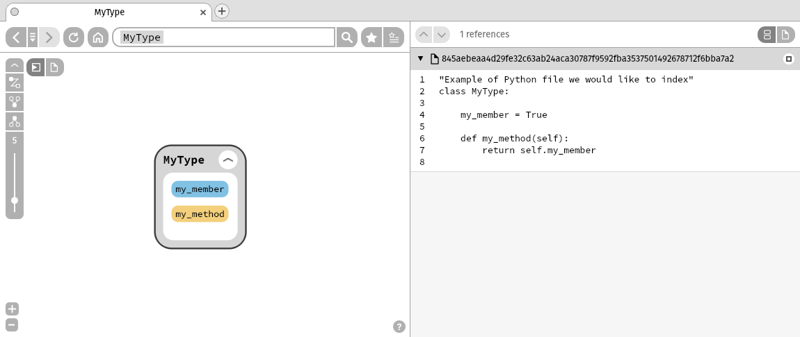

# Customization
Numbat also offers a few customization options, mostly to help with mapping data other than source code.

!!! warning
    These features can only be viewable with [NumbatUI](https://github.com/quarkslab/NumbatUI), Quarkslab fork of Sourcetrail, which is currently work in progress and really unstable. 

## Custom node types
Non-source code data might not fit in any of the existing node types, so we can use the [`set_node_type`](public_api.md#numbat.SourcetrailDB.set_node_type) function to change them to types that are more adapted.

The existing node types are: `annotation` `built-in type` `class` `enum` `enum constant` `field` `file` `function` `global variable` `interface` `macro` `method` `module` `namespace` `package` `struct` `symbol` `type` `type parameter` `typedef` `union`

Here, for example, the `typedef` node type is changed to `symlink` and `Symlinks` will be displayed in the overview instead of `Typedefs`.

```python linenums="1" hl_lines="8-10"
from numbat import SourcetrailDB
from pathlib import Path

db = SourcetrailDB.open(Path('my_database'), clear=True)

# add nodes, edges, etc...

# change node types
db.set_node_type("class", "Binaries", "binary")
db.set_node_type("typedef", "Symlinks", "symlink")

db.commit()
db.close()
```

<figure markdown>

  

  
  <figcaption>Modified node types, in the overview and the tooltip</figcaption>
</figure>

## Node / Edge colors
Nodes and edges (references) can also be recolored, using the [`change_node_color`](public_api.md#numbat.SourcetrailDB.change_node_color) and the [`change_edge_color`](public_api.md#numbat.SourcetrailDB.change_edge_color) methods.

These functions support hex codes and [SVG 1.0 color keywords](https://www.w3.org/TR/SVG11/types.html#ColorKeywords).

For nodes, the body (fill), border, text, icon and hatching can be colored separately.

```python linenums="1" hl_lines="18-21"
from numbat import SourcetrailDB
from pathlib import Path

db = SourcetrailDB.open(Path('my_database'), clear=True)

# record file
file_id = db.record_file(Path('file.py'))
db.record_file_language(file_id, 'python')

# add nodes
class_id = db.record_class(prefix="class", name="MyType", postfix="():")
field_id = db.record_field(name="my_member", parent_id=class_id)
meth_id = db.record_method(name="my_method", parent_id=class_id)

# add reference
ref_id = db.record_ref_usage(meth_id, field_id)

# change colors
db.change_node_color(file_id, fill_color="#DEB887", border_color="#B0C4DE",
    text_color="brown", icon_color="brown", hatching_color="#FFEBCD")
db.change_edge_color(ref_id, "green")

db.commit()
db.close()
```
<figure markdown>

  
  <figcaption>Recolored node</figcaption>

  
  <figcaption>Recolored edge</figcaption>
</figure>

## Hover menu text
Additional metadata can be added in the tooltip when hovering over a node or edge, using the `hover_display` attribute on creation.

This value replaces the original metadata.

```python linenums="1" hl_lines="7-8"
from numbat import SourcetrailDB
from pathlib import Path

db = SourcetrailDB.open(Path('my_database'), clear=True)

# add nodes
class_id = db.record_class(prefix="class", name="MyType", postfix="():",
    hover_display="example class used for demonstration")
field_id = db.record_field(name="my_member", parent_id=class_id)
meth_id = db.record_method(name="my_method", parent_id=class_id)

db.commit()
db.close()
```

<figure markdown>

  
  <figcaption>Additional data for a node</figcaption>
</figure>

## Custom commands
We can also use the [`set_custom_command`](public_api.md#numbat.SourcetrailDB.set_custom_command) method to set a user-defined command for each node that can be executed in the node's context menu.

A list is used for the command and its arguments, and a brief description can be provided separately. 

```python linenums="1" hl_lines="15-17"
from numbat import SourcetrailDB
from pathlib import Path

db = SourcetrailDB.open(Path('my_database'), clear=True)

# record file
file_id = db.record_file(Path('file.py'))
db.record_file_language(file_id, 'python')

# add nodes
class_id = db.record_class(prefix="class", name="MyType", postfix="():")
field_id = db.record_field(name="my_member", parent_id=class_id)
meth_id = db.record_method(name="my_method", parent_id=class_id)

# set command
db.set_custom_command(file_id, ["open", str(Path("file.py").absolute())],
    "Open in external window")

db.commit()
db.close()

```
<figure markdown>

  
  <figcaption>Custom command at the bottom of the context menu</figcaption>
</figure>

## File sideloading
Finally, we can link a file to any node using the [`associate_file_to_node`](public_api.md/#numbat.SourcetrailDB.associate_file_to_node) method. This makes it so that the full content of the file can be displayed when selecting the node, without storing the content directly in the database nor creating an additional node for the file.\
The sideloaded file is stored in the `[project_name]_files/` directory next to the database.

```python linenums="1" hl_lines="12-13"
from numbat import SourcetrailDB
from pathlib import Path

db = SourcetrailDB.open(Path('my_database'), clear=True)

# Add nodes
class_id = db.record_class(prefix="class", name="MyType",
                           postfix="():")
field_id = db.record_field(name="my_member", parent_id=class_id)
meth_id = db.record_method(name="my_method", parent_id=class_id)

# Sideload file
db.associate_file_to_node(class_id, Path("file.py"), True)

db.commit()
db.close()

```
<figure markdown>

  
  <figcaption>Sideloaded file on MyType</figcaption>
</figure>