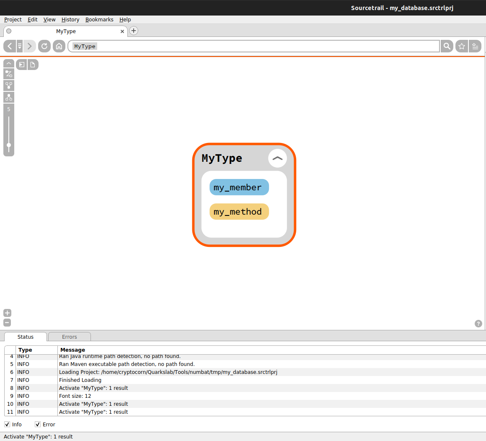
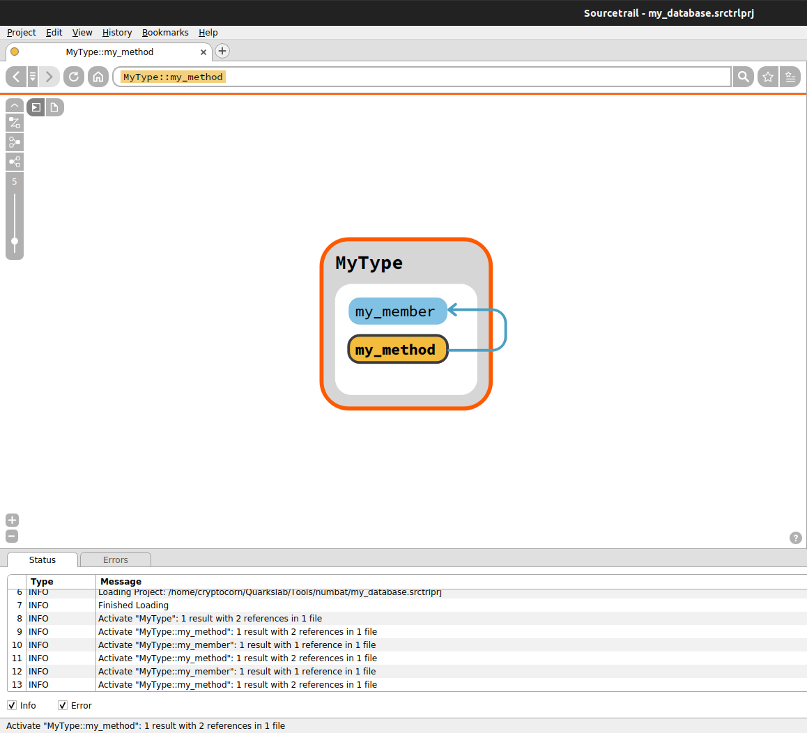
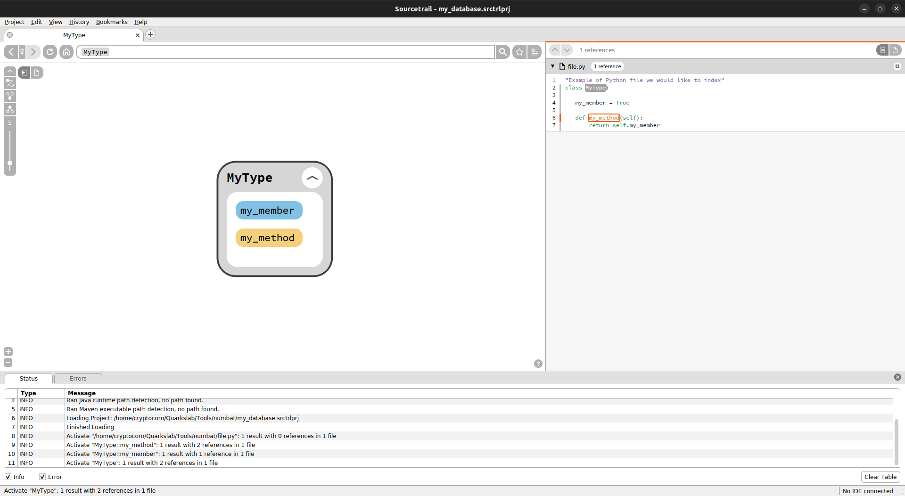
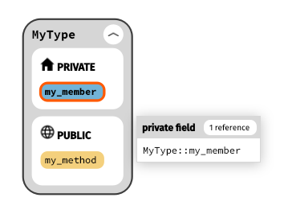

# Tutorial

To understand the power of Numbat, we will register the different symbols contained in `file.py`.

???+ abstract "file.py"
    ``` py linenums="1"
    "Example of Python file we would like to index"
    class MyType:

        my_member = True

        def my_method(self):
            return self.my_member
    ```

## Database Manipulation

First we are going to create a SourcetrailDB database. It could be done using
either [`open`](public_api.md#numbat.SourcetrailDB.open) or [`create`](public_api.md#numbat.SourcetrailDB.create), depending
on if you want to open an already existing db or create one. In this tutorial we will create a new one or clear the old
one with the same name using the following code.

```python linenums="1"
from numbat import SourcetrailDB
from pathlib import Path

db = SourcetrailDB.open(Path('my_database'), clear=True)
```

After having added all the symbols, do not forget to [`commit`](public_api.md#numbat.SourcetrailDB.commit) your work and
then  [`close`](public_api.md#numbat.SourcetrailDB.close) the DB.

```python linenums="1" hl_lines="6-7"
from numbat import SourcetrailDB
from pathlib import Path

db = SourcetrailDB.open(Path('my_database'), clear=True)
# do some stuff
db.commit()
db.close()
```

It will create two files: a Sourcetrail DB file (`.srctrldb`) and project file (`.srctrlprj`). You can open the second
one with your local Sourcetrail to explore your data.

## Add Symbols

We could add a lot of different symbols as described in
the [full API reference](public_api.md#numbat.SourcetrailDB.record_symbol_node) but in anycase, they all have the
same signature:

```python
record_XX(
    name="",
    prefix="",
    postfix="",
    delimiter=NameHierarchy.NAME_DELIMITER_CXX,
    parent_id=None,
    is_indexed=True,
)
```

- `name`: symbol name.
- `prefix`: what to put before the name like `void *`.
- `postfix`: what to put after the name like `()`.
- `delimiter`: the delimiter between a parent and its child, by default it is `::`. The authorized delimiters are: `/`, `::`, `.` or `@`.
- `parent_id`: if your symbol is a child of another symbol.
- `is_indexed`: if your symbol exists in your input data or if it should exist but was not there (it will show as a grey
  shadow).

If we complete our script, we will need to add the class `My Type`, the field `my_member` and the method `my_method`.

```python linenums="1" hl_lines="6-10"
from numbat import SourcetrailDB
from pathlib import Path

db = SourcetrailDB.open(Path('my_database'), clear=True)

# Add symbols
class_id = db.record_class(prefix="class", name="MyType",
                           postfix="():")
field_id = db.record_field(name="my_member", parent_id=class_id)
meth_id = db.record_method(name="my_method", parent_id=class_id)

db.commit()
db.close()
```

When we open the current database with Sourcetrail after running this script, we obtain the following view:
<figure markdown>
  
  <figcaption>Sourcetrail view after adding symbols.</figcaption>
</figure>

## Relationships

It is possible to add links between the different symbols after they have been created with the
commands `record_ref_XX`. These relationships could be
of [several types](public_api.md#numbat.SourcetrailDB.record_ref_member). Here, in `file.py`, we can see that `my_method` is
using the field `my_member`, so we could add an `USAGE` relation.

```python linenums="1" hl_lines="11-12"
from numbat import SourcetrailDB
from pathlib import Path

db = SourcetrailDB.open(Path('my_database'), clear=True)

# Add symbols
class_id = db.record_class(prefix="class", name="MyType",
                           postfix="():")
field_id = db.record_field(name="my_member", parent_id=class_id)
meth_id = db.record_method(name="my_method", parent_id=class_id)
# Add relationships
db.record_ref_usage(meth_id, field_id)

db.commit()
db.close()
```

<figure markdown>
  
  <figcaption>Usage link between a method and field member of the same class.</figcaption>
</figure>

## Record Associated Files
Optionally, you can record inside Sourcetrail database a file corresponding to your graph data.

```python linenums="1" hl_lines="6-8"
from numbat import SourcetrailDB
from pathlib import Path

db = SourcetrailDB.open(Path('my_database'), clear=True)

# Record file
file_id = db.record_file(Path('file.py'))
db.record_file_language(file_id, 'python')
# Add symbols
class_id = db.record_class(prefix="class", name="MyType",
                           postfix="():")
field_id = db.record_field(name="my_member", parent_id=class_id)
meth_id = db.record_method(name="my_method", parent_id=class_id)
# Add relationships
db.record_ref_usage(meth_id, field_id)

db.commit()
db.close()
```

## Link Symbols and Source Code
As you have inserted the source code and the symbols, you should create links between them to indicate to Sourcetrail where each symbol is located in the code, and if it is the case, its scope. For that, you could respectively use the [`record_symbol_location`](public_api.md#numbat.SourcetrailDB.record_symbol_location) and [`record_symbol_scope_location`](public_api.md#numbat.SourcetrailDB.record_symbol_scope_location) methods.

```python linenums="1" hl_lines="12 13 15 17 18""
from numbat import SourcetrailDB
from pathlib import Path

db = SourcetrailDB.open(Path('my_database'), clear=True)

# Record file
file_id = db.record_file(Path('file.py'))
db.record_file_language(file_id, 'python')
# Add symbols
class_id = db.record_class(prefix="class", name="MyType",
                           postfix="():")
db.record_symbol_location(class_id, file_id, 2, 7, 2, 12)
db.record_symbol_scope_location(class_id, file_id, 2, 1, 7, 1)
field_id = db.record_field(name="my_member", parent_id=class_id)
db.record_symbol_location(field_id, file_id, 4, 5, 4, 13)
meth_id = db.record_method(name="my_method", parent_id=class_id)
db.record_symbol_location(meth_id, file_id, 6, 9, 6, 17)
db.record_symbol_scope_location(meth_id, file_id, 6, 1, 7, 1)
# Add relationships
db.record_ref_usage(meth_id, field_id)

db.commit()
db.close()
```

<figure markdown>
  
  <figcaption> Symbols are located into the source code.</figcaption>
</figure>

## Access specifiers
To record an access specifier (public, private, etc...) for a class attribute, the [`record_[public|private|etc...]_access`](public_api.md#numbat.SourcetrailDB.record_public_access) can be used.

```python linenums="1" hl_lines="21-23"
from numbat import SourcetrailDB
from pathlib import Path

db = SourcetrailDB.open(Path('my_database'), clear=True) 

# Record file
file_id = db.record_file(Path('file.py'))
db.record_file_language(file_id, 'python')
# Add symbols
class_id = db.record_class(prefix="class", name="MyType",
                           postfix="():")
db.record_symbol_location(class_id, file_id, 2, 7, 2, 12)
db.record_symbol_scope_location(class_id, file_id, 2, 1, 7, 1)
field_id = db.record_field(name="my_member", parent_id=class_id)
db.record_symbol_location(field_id, file_id, 4, 5, 4, 13)
meth_id = db.record_method(name="my_method", parent_id=class_id)
db.record_symbol_location(meth_id, file_id, 6, 9, 6, 17)
db.record_symbol_scope_location(meth_id, file_id, 6, 1, 7, 1)
# Add relationships
db.record_ref_usage(meth_id, field_id)
# Add access specifiers
db.record_public_access(meth_id)
db.record_private_access(field_id)

db.commit()
db.close()
```

<figure markdown>
  
  <figcaption> Public and private access specifiers</figcaption>
</figure>